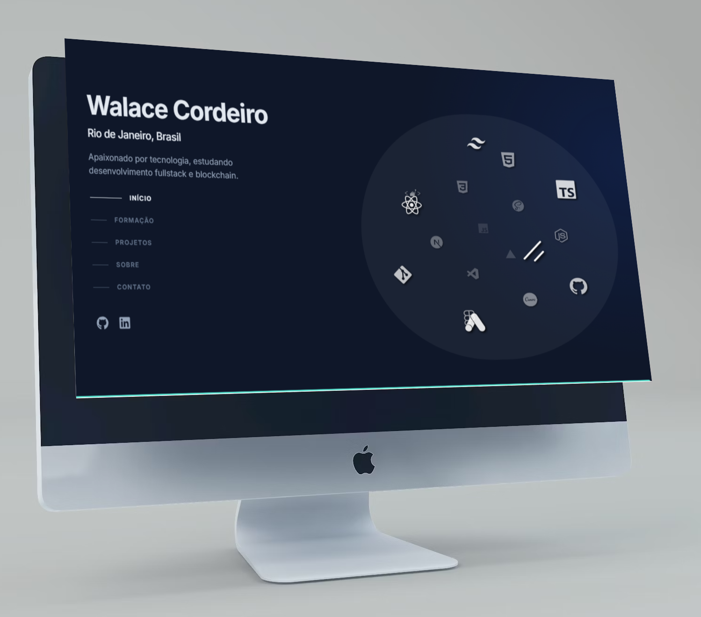

<h1 align="center">Projeto: Site Portfólio</h1>

Este projeto é um site de portfólio pessoal desenvolvido com `React e Next.js`. Ele exibe uma lista de ícones representando diferentes tecnologias e ferramentas que utilizo no meu trabalho. O layout é responsivo e projetado para ser visualmente atraente.

<p align="center">
  <a href="#funcionalidades">Funcionalidades</a>&nbsp;&nbsp;&nbsp;|&nbsp;&nbsp;&nbsp;
  <a href="#technologias">Tecnologias</a>&nbsp;&nbsp;&nbsp;|&nbsp;&nbsp;&nbsp;
  <a href="#clone-e-use-como-template">Clonar</a>&nbsp;&nbsp;&nbsp;|&nbsp;&nbsp;&nbsp;
  <a href="#contato">Contato</a>&nbsp;&nbsp;&nbsp;|&nbsp;&nbsp;&nbsp;
  <a href="#licença">Licença</a>
</p>

<br>

<p align="center">
  
</p>

### Funcionalidades

- Apresentação de ícones de tecnologia.
- Layout responsivo adaptável a diferentes tamanhos de tela.
- Utilização de variáveis de ambiente para integração com o GitHub.

### Technologias


<br>

## Clone e use como Template

Sinta-se à vontade para fazer um clone deste projeto e utilizá-lo como template para seu próprio portfólio!

1. Clone o repositório:

   ```bash
   git clone https://github.com/seu-usuario/walace-cordeiro.git
   ```

2. Navegue até o diretório do projeto:

   ```bash
   cd walace-cordeiro
   ```

### Variáveis de Ambiente

Este projeto utiliza uma variável de ambiente chamada `NEXT_PUBLIC_GITHUB_TOKEN`, armazenada no arquivo `.env.local`. O prefixo `NEXT_PUBLIC_` é obrigatório em projetos Next.js para que variáveis sejam acessíveis no lado do cliente.

### Obtendo seu Token do GitHub

1. Acesse sua conta do GitHub.
2. No canto superior direito, clique na sua foto de perfil e depois em **Settings**.
3. No menu lateral, vá até **Developer settings**.
4. Clique em **Personal access tokens**.
5. Em seguida, clique em **Tokens (classic)**.
6. Clique em **Generate new token**.
7. Dê um nome ao seu token, defina a data de expiração e selecione os escopos desejados (as permissões que deseja conceder).
8. Clique em **Generate token** e copie o token gerado (lembre-se de guardá-lo em um lugar seguro, pois não será possível vê-lo novamente).
9. Por fim, crie um arquivo `.env.local` na raiz do projeto e defina sua variável de ambiente:

   ```dotenv
   NEXT_PUBLIC_GITHUB_TOKEN=seu_token_do_github_aqui
   ```

4. Instale as dependências:

   ```bash
   npm install
   ```

5. Inicie o servidor de desenvolvimento:

   ```bash
   npm run dev
   ```

6. Acesse o site em [http://localhost:3000](http://localhost:3000).

<br>

## Contato

Para dúvidas ou sugestões, entre em contato:

- Email: walacecordeirodossantos@gmail.com
- LinkedIn: [walace-cordeiro-dos-santos](https://www.linkedin.com/in/walace-cordeiro-dos-santos/)

<br>

## Licença

Este projeto está licenciado sob a . Sinta-se à vontade para usar, modificar e distribuir este projeto.


